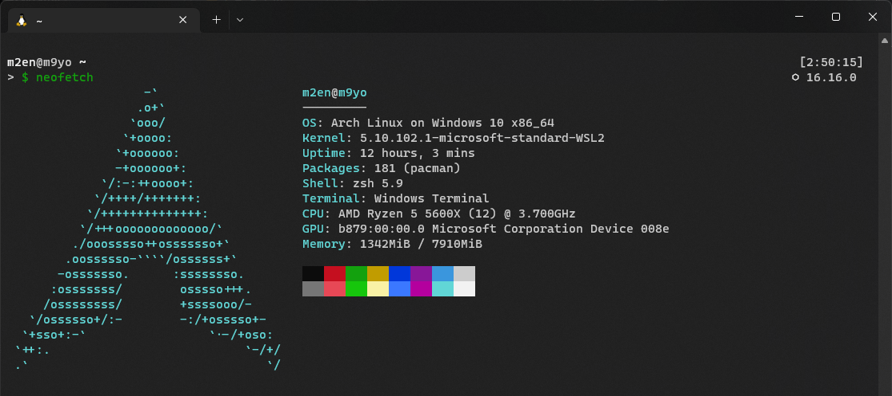

```shell
m2en@m9yo ~/github.com/m2en
> $ gh auth login
> $ gh open m2en profile
```

```shell
> $ gh profile open status
```

<p align="left"> 

  
  
  

</p>

```shell
> $ gh profile open languages
```

- [TypeScript](https://www.typescriptlang.org/)
- [JavaScript](https://developer.mozilla.org/en-US/docs/Web/JavaScript)
- [Java](https://www.java.com/en/)

(.... learning...)

- [Rust](https://www.rust-lang.org/)
- [Kotlin](https://kotlinlang.org/)

```shell
> $ gh profile open skill-other
```

- JetBrains
- Git
- WSL2 (Arch)
- Windows Terminal
- DevToys



```shell
> $ gh profile open wakatime
```

<!--START_SECTION:waka-->

```text
From: 17 August 2021 - To: 16 August 2022

Total Time: 790 hrs 31 mins

TypeScript       284 hrs 17 mins ⣿⣿⣿⣿⣿⣿⣿⣷⣀⣀⣀⣀⣀⣀⣀⣀⣀⣀⣀⣀⣀⣀⣀⣀⣀   31.20 %
Java             203 hrs 40 mins ⣿⣿⣿⣿⣿⣶⣀⣀⣀⣀⣀⣀⣀⣀⣀⣀⣀⣀⣀⣀⣀⣀⣀⣀⣀   22.35 %
JavaScript       99 hrs 35 mins  ⣿⣿⣶⣀⣀⣀⣀⣀⣀⣀⣀⣀⣀⣀⣀⣀⣀⣀⣀⣀⣀⣀⣀⣀⣀   10.93 %
Markdown         70 hrs 31 mins  ⣿⣿⣀⣀⣀⣀⣀⣀⣀⣀⣀⣀⣀⣀⣀⣀⣀⣀⣀⣀⣀⣀⣀⣀⣀   07.74 %
JSON             61 hrs 13 mins  ⣿⣶⣀⣀⣀⣀⣀⣀⣀⣀⣀⣀⣀⣀⣀⣀⣀⣀⣀⣀⣀⣀⣀⣀⣀   06.72 %
YAML             34 hrs 42 mins  ⣿⣀⣀⣀⣀⣀⣀⣀⣀⣀⣀⣀⣀⣀⣀⣀⣀⣀⣀⣀⣀⣀⣀⣀⣀   03.81 %
```

<!--END_SECTION:waka-->
